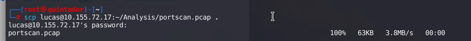
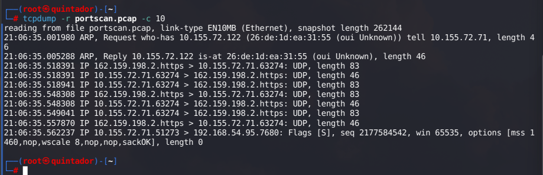
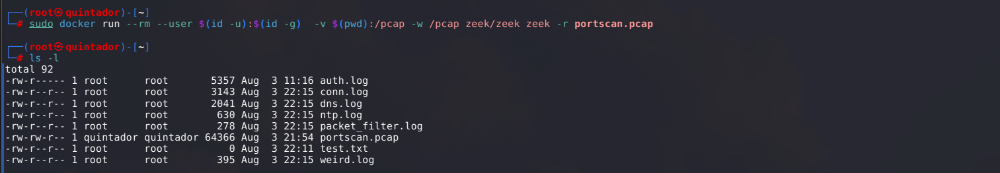
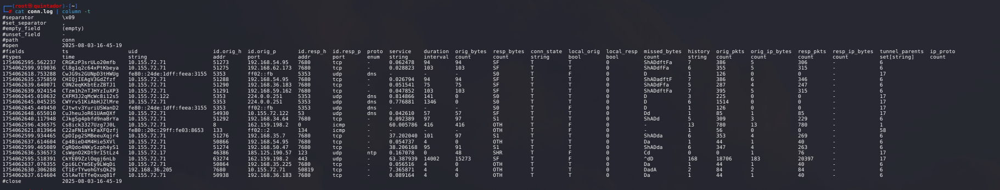

# Port Scan Analysis: Self-Guided Lab

A hands-on lab exploring packet capture analysis and automated network event extraction using Zeek and Docker.

## Table of Contents
- [Introduction](#introduction)
- [Lab Setup](#lab-setup)
- [Step-by-Step Walkthrough](#step-by-step-walkthrough)
- [Results](#results)
- [Screenshots](#screenshots)
- [Reproduction Guide](#reproduction-guide)
- [Credits & Resources](#credits--resources)

## Introduction
This lab investigates port scanning activity by capturing packets, securely transferring them, and processing with Zeek for detailed analysis.

## Lab Setup

- Prepare environment with tcpdump, Zeek, Docker.
- Capture packets as shown below.

## Step-by-Step Walkthrough

1. **Transfer the Capture File**

The first step involved using SCP to copy `portscan.pcap` from a remote Linux server to the Kali system:

2. **Validate File Contents**

To confirm the file copied correctly and to inspect its contents, `tcpdump` was used:

3. **Run Zeek with Docker**
I was not able to download the right version of zeek in my Kali machine, so i proceeded to use docker. 

4. **View Output Files**

## Results
Key findings, event logs generated, and insights from scanning activity.

## Reproduction Guide

- Clone this repository.
- Install required software (tcpdump, Docker, Zeek).
- Run steps as shown above.

## Credits & Resources
- [Zeek Documentation](https://docs.zeek.org/)

